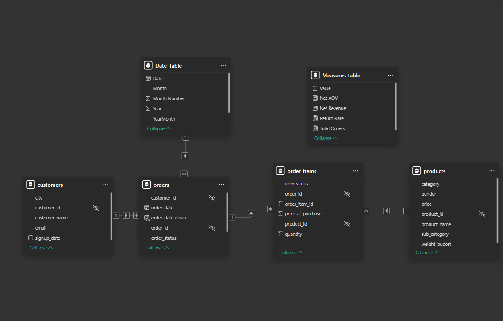

# E-Commerce Revenue & Customer Performance Analysis
### SQL, Python & Power BI Sales Analytics — Retail / E-Commerce Industry

---

## Dashboard Overview

---

# Executive Summary

This project analyzes an **e-commerce retail dataset** to evaluate sales performance, customer purchasing behavior, product performance, and return patterns.

The objective of the analysis was to identify **key revenue drivers, operational risks related to product returns, and changes in customer demand over time**.

Using **SQL for data analysis** and **Power BI for visualization**, an interactive dashboard was built to track critical business metrics such as **Net Revenue, Order Volume, Average Order Value (AOV), and Return Rate**.

### Key Insights

- Total revenue reached **₹78.7M across 16K orders**, with an average order value of **₹4,810**  
- Revenue **peaked in early 2025 before declining later in the year**  
- The decline was driven by **reduced order volume rather than pricing changes**  
- **Footwear contributes the majority of revenue but also has the highest return rate (~29%)**  
- A small number of **top-performing products generate a significant share of total revenue**

### Business Impact

The analysis highlights opportunities to:

- Reduce return rates in high-volume categories such as footwear
- Improve product quality or sizing information
- Focus marketing and promotional efforts on **top-performing products**
- Develop strategies to **increase repeat purchases and stabilize demand**

---

# Business Problem

E-commerce companies often struggle to answer important operational questions such as:

- Which products and categories **drive the most revenue**
- Which categories have **high return rates**
- Whether revenue changes are caused by **price changes or order volume**
- Which products contribute most significantly to overall sales

Without clear visibility into these metrics, businesses risk making decisions based on incomplete information.

This project addresses these challenges by analyzing transactional sales data and building a **decision-support dashboard** to monitor business performance.

---

# Data Model / Schema

The dataset follows a **relational transactional schema**, similar to a typical e-commerce database structure.

The analysis is built around four core tables:

- **customers**
- **orders**
- **order_items**
- **products**

### Schema Diagram

### Table Relationships

| Table | Description |
|------|-------------|
| customers | Contains customer-level information such as city and signup date |
| orders | Stores order-level transactions and timestamps |
| order_items | Contains product-level line items within each order |
| products | Product catalog including category and price |

Key relationships:

- customers.customer_id → orders.customer_id
- orders.order_id → order_items.order_id
- products.product_id → order_items.product_id

This structure enables analysis at multiple levels:

- Customer behavior
- Order-level performance
- Product-level sales
- Category-level contribution

---

# Dataset

The dataset used in this project is a **synthetic e-commerce dataset generated for analytical practice and portfolio development**.

The data simulates realistic retail business activity including:

- Customer registrations
- Order transactions
- Product purchases
- Product returns
- Category-level sales patterns

### Dataset Characteristics

- ~3,500 customers
- ~30,000 order item transactions
- ~200 products
- 18 months of simulated sales activity

The dataset was programmatically generated using **SQL scripts to simulate realistic business scenarios**, including:

- Seasonal order trends
- Category-specific return behavior
- Customer purchasing patterns
- Product-level sales distribution

The SQL scripts used to generate the dataset are included in the repository for **transparency and reproducibility**.

---

# Methodology

The project was completed using a combination of **SQL analysis and Power BI dashboard development**.

### SQL Data Analysis

SQL was used to calculate core business metrics including:

- Net Revenue
- Gross Revenue
- Average Order Value (AOV)
- Monthly Growth
- Category Revenue Contribution
- Customer Repeat Rate
- Cohort Retention Metrics

Advanced SQL techniques used include:

- CTEs (Common Table Expressions)
- Window functions
- Aggregations
- Customer segmentation
- Cohort analysis

## Python Revenue Analysis & Anomaly Detection

In addition to SQL analysis and dashboard development, Python was used to perform deeper analytical exploration of revenue trends.

The following analytical tasks were performed using **Pandas and Matplotlib**:

- Monthly revenue trend analysis
- Category-level revenue analysis
- Top product performance analysis
- Automated anomaly detection in revenue trends
- Automated generation of business insights

### Revenue Trend Analysis

Monthly revenue was aggregated using Python to replicate and validate the dashboard metrics.  
This analysis allows the revenue trend to be analyzed programmatically outside BI tools.

### Revenue Anomaly Detection

Z-score based anomaly detection was applied to the monthly revenue series to identify periods where revenue significantly deviates from the historical average.

Values exceeding **1.5 standard deviations from the mean** were flagged as anomalies.

These anomalies correspond to revenue peaks and unusually low revenue periods, highlighting potential changes in demand patterns.

## Automated Business Insight Generation

To simulate AI-assisted analytics workflows, Python was used to automatically generate business insights from aggregated metrics.

Key metrics such as:

- Total Revenue
- Top Performing Category
- Top Performing Product
- Return Rate

were computed programmatically and converted into automated textual insights.

This approach demonstrates how analytical pipelines can automatically transform numerical metrics into business-friendly explanations.

---

### Power BI Dashboard Development

Power BI was used to build an interactive analytics dashboard including:

- Executive KPI layer
- Revenue trend analysis
- Category performance breakdown
- Product performance analysis
- Interactive filtering by year and city

---

# Skills & Tools Used

## SQL
- CTEs (Common Table Expressions)
- Window Functions
- Joins
- Aggregations
- Customer segmentation
- Cohort analysis

## Python
- Pandas for data manipulation
- Matplotlib for visualization
- Revenue trend analysis
- Z-score anomaly detection
- Automated insight generation
  
## Power BI
- Data modeling (Star schema)
- DAX measures
- Calculated columns
- Interactive dashboards
- KPI visualization
- Time series analysis

## Data Analysis Concepts
- Revenue modeling
- Return rate analysis
- Customer repeat behavior
- Product performance analysis
- Sales trend analysis
- Anomaly detection

---

# Results & Business Recommendations

### Key Findings

#### Revenue Trend

Revenue increased steadily throughout **2024** and peaked in **early 2025**, followed by a decline later in the year.

Analysis of the orders trend shows that the decline was driven by **falling order volume rather than changes in pricing or product value**.

#### Category Performance

- **Footwear** contributes the majority of total revenue
- However, footwear also shows the **highest return rate**

This suggests potential operational issues related to:

- Product sizing
- Product quality
- Customer expectations

#### Product Contribution

A small number of **top-performing products generate a large portion of overall revenue**, indicating product concentration.

---

### Business Recommendations

Based on the analysis:

- Investigate root causes of **high footwear returns**
- Improve **product descriptions and sizing guides**
- Focus marketing on **top-performing products**
- Develop strategies to **increase repeat customer purchases**

---

# Next Steps

If additional time and data were available, the analysis could be expanded to include:

- **RFM customer segmentation**
- **Customer Lifetime Value (CLV) analysis**
- **Return reason analysis**
- **Profitability analysis (revenue vs cost)**
- **Predictive sales forecasting**

---

# Project Limitations

Since the dataset is synthetically generated, it does not fully capture all real-world business complexities such as:

- Marketing spend
- Profit margins
- Detailed return reasons
- Inventory constraints

Future analysis could incorporate these datasets for deeper operational insights.

## How to Reproduce This Analysis

1. Clone the repository
git clone https://github.com/Priya200227/ecommerce-sales-analysis.git

2. Open the Python notebook
    

3. Run the notebook to reproduce analysis.

4. Open the Power BI dashboard:
    
---

### Tags

`Data Analytics`  
`SQL`  
`Python`  
`Power BI`  
`Business Intelligence`  
`E-Commerce Analytics`
