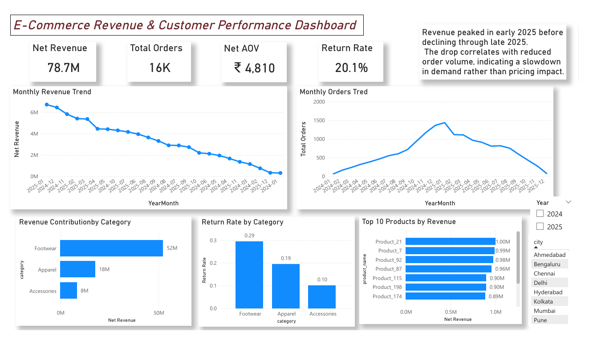
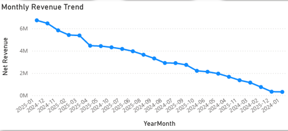
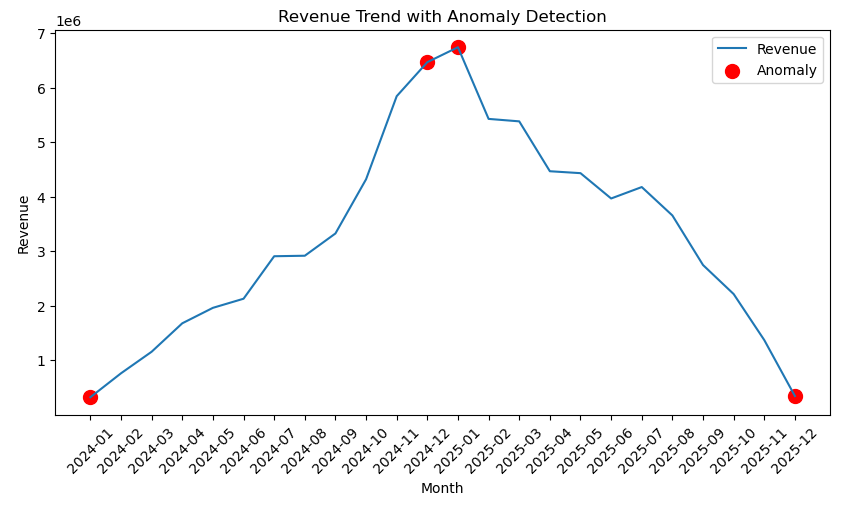

# E-Commerce Revenue & Customer Performance Analysis
### Retail Analytics Project | SQL • Python • Power BI

This project analyzes an **e-commerce retail dataset** to understand sales performance, customer purchasing behavior, product performance, and return patterns.

Using **SQL for data analysis, Python for exploratory analysis, and Power BI for visualization**, the project identifies key revenue drivers and operational risks related to product returns.

---

# Dashboard Preview

---

# Executive Summary

E-commerce businesses generate large volumes of transactional data but often lack clear visibility into the drivers of revenue growth and product performance.

This project analyzes sales data to answer key business questions:

- Which products and categories drive the most revenue?
- How does revenue change over time?
- Which categories have the highest return rates?
- Which products contribute the most to overall sales?

### Key Insights

- Total revenue reached **₹78.7M across 16K orders**
- **Average Order Value (AOV) ≈ ₹4,810**
- Revenue peaked in **early 2025 before declining later**
- **Footwear generates the highest revenue but also the highest return rate (~29%)**
- A small number of **top products drive a large share of revenue**

### Business Impact

The analysis highlights opportunities to:

- Reduce return rates in high-volume categories
- Improve product information such as sizing or descriptions
- Focus marketing efforts on top-performing products
- Increase repeat customer purchases

---

# Business Problem

E-commerce companies often struggle to answer important operational questions:

- Which products generate the most revenue?
- Which categories experience high product returns?
- Are revenue changes driven by pricing or order volume?
- Which products contribute most significantly to total sales?

Without clear insight into these metrics, businesses risk making decisions based on incomplete information.

This project builds a **data-driven sales analytics dashboard** to support business decision-making.

---

# Dataset

The dataset used in this project is a **synthetic e-commerce dataset generated for analytical practice and portfolio development**.

The data was programmatically generated using **SQL scripts with AI-assisted data simulation** to mimic realistic retail transactions.

The dataset simulates typical e-commerce operations including:

- Customer registrations
- Order transactions
- Product purchases
- Product returns
- Category-level sales patterns

### Dataset Characteristics

- ~3,500 customers
- ~16,000 orders
- ~30,000 order item transactions
- ~200 products
- ~18 months of simulated sales activity

The dataset structure follows a **typical e-commerce relational schema**, allowing analysis of:

- Customer purchasing behavior
- Product performance
- Category-level revenue
- Return rate patterns

The SQL scripts used to generate the dataset are included in the repository for **transparency and reproducibility**.

---

# Methodology

The analysis was conducted using **SQL, Python, and Power BI**.

### SQL Analysis

SQL was used to compute core business metrics including:

- Total Revenue
- Average Order Value (AOV)
- Monthly Revenue Trends
- Category Revenue Contribution
- Product Performance
- Return Rate Analysis

Techniques used:

- Joins
- Aggregations
- CTEs
- Window functions

---

### Python Analysis

Python was used for deeper analysis and visualization.

Key tasks performed:

- Monthly revenue trend analysis
- Product performance exploration
- Revenue anomaly detection
- Automated business insight generation

Libraries used:

- Pandas
- NumPy
- Matplotlib

Example visualizations:

---

### Power BI Dashboard

An interactive Power BI dashboard was built to monitor key sales metrics.

Dashboard components include:

- Executive KPI metrics
- Monthly revenue trend
- Category performance breakdown
- Product performance analysis
- Return rate monitoring

---

# Skills Demonstrated

### SQL
- Joins
- Aggregations
- CTEs
- Window Functions
- Revenue calculations

### Python
- Pandas data manipulation
- Matplotlib visualization
- Revenue trend analysis
- Anomaly detection

### Power BI
- Data modeling
- DAX measures
- KPI dashboards
- Interactive visualizations

### Data Analysis Concepts

- Revenue analytics
- Return rate analysis
- Product performance analysis
- Customer purchasing behavior
- Sales trend analysis

---

# Results & Business Recommendations

### Key Findings

- Revenue grew steadily before declining later in the year
- The decline was caused primarily by **lower order volume**
- **Footwear dominates revenue but also drives returns**
- A small number of products generate a large share of total sales

### Business Recommendations

- Investigate root causes of high return rates in footwear
- Improve product descriptions and sizing guides
- Focus promotions on top-performing products
- Encourage repeat purchases through targeted campaigns

---

# Next Steps

Future improvements could include:

- Customer segmentation (RFM analysis)
- Customer lifetime value analysis
- Profitability analysis
- Predictive sales forecasting

Additional marketing and customer behavior data could provide deeper insights into purchasing patterns.

---

# Tools Used

- SQL
- Python (Pandas, NumPy, Matplotlib)
- Power BI
- Jupyter Notebook

---

# How to Reproduce This Project

1. Clone the repository  
git clone https://github.com/Priya200227/ecommerce-sales-analysis.git

2. Run SQL queries from the **sql** folder

3. Open the Python notebook for analysis

4. Open the Power BI dashboard to explore the interactive report

---

# Tags

`Data Analytics` 
`SQL`  
`Python`  
`Power BI`  
`Business Intelligence`  
`E-Commerce Analytics`
