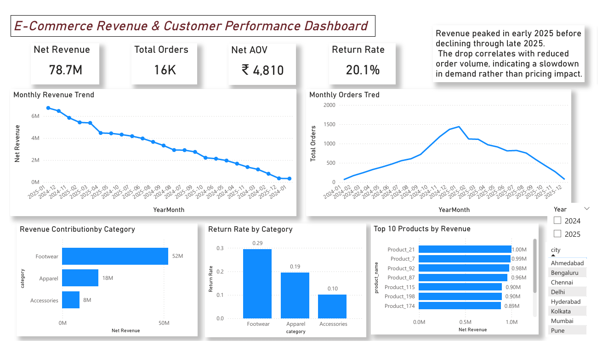

# 📊 Revenue Decline & Return Optimization Analysis

### E-Commerce Analytics Project | SQL • Python • Power BI

---

## 🔴 Business Problem

An e-commerce business experienced a **decline in revenue after early 2025**, despite stable pricing (AOV).

The challenge was to identify:

* What caused the revenue decline?
* Which categories and products are impacting performance?
* How customer behavior influences revenue?
* What actions can recover growth?

---

## 🎯 Objective

Build a data-driven solution to:

* Diagnose revenue decline drivers
* Identify high-return and high-risk product categories
* Analyze customer contribution to revenue
* Provide actionable business recommendations

---

## 📊 Dashboard Preview



---

## 📌 Dashboard Structure

### 🔹 Page 1: Executive Overview

* KPI metrics: Revenue, Orders, AOV, Return Rate
* Monthly Revenue Trend
* Monthly Orders Trend
* Category Performance (Trend)
* Customer Segmentation (New vs Repeat)
* Geographic Revenue Distribution
* Key Business Insights

---

### 🔹 Page 2: Product & Return Analysis

* Revenue vs Return Rate (Product-level scatter analysis)
* Return Rate by Category
* Top Revenue-Generating Products
* Customer Revenue Contribution

---

## 🔍 Key Insights

* Total revenue reached **₹78.7M across 16K orders**
* Revenue declined after early 2025 due to a **drop in order volume**, while AOV remained stable
* **Footwear contributes ~65% of revenue but has the highest return rate (~26%)**
* **Repeat customers drive ~80% of total revenue**, indicating strong retention but dependency risk
* Several **high-revenue products also have high return rates**, impacting efficiency

---

## 💡 Business Recommendations

* Reduce return rates in Footwear by improving **product quality and sizing accuracy**
* Identify and optimize **high-return, high-revenue products**
* Focus marketing efforts on **top-performing products**
* Increase repeat purchases through **targeted retention campaigns**
* Monitor order volume trends to detect early demand drops

---

## 🧠 Analytical Approach

### 🔹 SQL

* Revenue, AOV, and return rate calculations
* Product and category performance analysis
* Joins, aggregations, CTEs, and window functions

### 🔹 Python

* Trend validation and exploratory analysis
* Revenue pattern identification
* Data preprocessing and EDA

### 🔹 Power BI

* Data modeling and relationships
* DAX measures (KPIs, return rate, customer segmentation)
* Interactive dashboard with filters and drill-down

---

## 🧱 Dataset

Synthetic dataset generated to simulate real-world e-commerce operations:

* ~3,500 customers
* ~16,000 orders
* ~30,000 order items
* ~200 products
* ~18 months of transaction data

---

## 🛠 Tools Used

* SQL
* Python (Pandas, NumPy, Matplotlib)
* Power BI

---

## 🚀 Skills Demonstrated

* Business problem framing
* Revenue and trend analysis
* Return rate diagnostics
* Product performance analysis
* Customer segmentation
* Dashboard storytelling
* Data-driven decision making

---

## 📈 Project Outcome

This project demonstrates the ability to:

* Translate raw data into **actionable business insights**
* Identify **root causes of revenue decline**
* Recommend **data-driven strategies**
* Build **interactive dashboards for decision-making**

---

## 🔮 Future Improvements

* Customer segmentation (RFM analysis)
* Customer Lifetime Value (CLV)
* Profitability analysis
* Sales forecasting

---

## ⚙️ How to Run the Project

1. Clone the repository

   ```bash
   git clone https://github.com/Priya200227/ecommerce-sales-analysis.git
   ```

2. Run SQL scripts from the `/sql` folder

3. Execute Python notebooks

4. Open Power BI dashboard

---

## 🏷 Tags

`Data Analyst` `SQL` `Python` `Power BI` `E-Commerce Analytics` `Business Intelligence`
